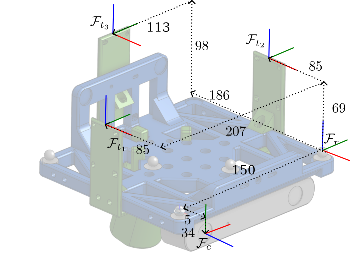

STAR-loc: Dataset for STereo And Range-based localization
=========================================================

This repository contains all the data files of the STAR-localization dataset in csv format.

This repository is the recommended starting point for using the dataset. For background information on the data, including setup descriptions, calibration and postprocessing procedures, and links to the raw datafiles (in ROS bag format) please refer to our [arXiv paper](https://arxiv.org/abs/2309.05518). 

## How to use

The dataset is provided in raw csv files and can thus be parsed from your programming language of choice. For python, we recommend to take a look at the `reader.py` module provided in this repository (installation of `pandas` required). 

Please cite the following [arXiv paper](https://arxiv.org/abs/2309.05518) if you are using this dataset. 

```bibtex
@article{starloc,
  title = {{{STAR-loc}}: {{Dataset}} for {{STereo And Range-based}} Localization},
  author = {D{\"u}mbgen, Frederike and Shalaby, Mohammed A. and Holmes, Connor and Cossette, Charles C. and Forbes, James R. and Le Ny, Jerome and Barfoot, Timothy D.},
  year = {2023},
  journal = {arXiv:2309.05518 [cs.RO]},
  doi = {10.48550/arXiv.2309.05518},
}
```

## Frames

### Definitions
We use the following conventions for frames. The world frame is the Vicon system's reference frame. The rig frame ($F_r$) is the frame on the sensor rig, which is tracked by the Vicon system. See Figure 1 for how it is defined. The camera frame ($ F_c $) is centered in the left camera with z pointing in the viewing direction and y pointing down (see Figure 1, and note that the camera is mounted upside-down on the rig). Note that the dimensions of the camera frame are approximate -- they are refined in the calibration procedure (more details below). The IMU frame is inside the stereo camera and defined by its transform to the left camera frame, which is provided by the manufacturers. We also define the tag frames $F_{t_i}$, centered at the three different tag locations, and orientated as the rig frame. 


<p style="text-align: center;"><em> Figure 1: Definition of frames and their (approximate) dimensions. Note that the camera frame dimensions are inaccuarate. The calibrated dimensions can be found in the calib.json files of each data directory. </em></p>

### Frame conventions 

We use quaternion $q_{ab}$ to define the orientation from frame b to frame a. Denoting the associated rotation matrix by $C_{ab}$, we have:

$$
q_a = C_{ab} q_b
$$

where $q_b$ is a vector expressed in frame $b$ and $q_a$ is the same vector expressed in frame $a$. 


## File description

All csv files contain the following columns:

- time_s: time since start of experiment (first Vicon measurement)
- x,y,z:  ground truth *rig* pose (translation)
- w, rot_x, rot_y, rot_z:  ground truth *rig* pose (rotation)

Ultra-Wideband measurements (`<dataset-name>/uwb.csv`):

- range: raw distance measurement in meters
- from_id: tag id (1 or 2), measurement radio on the rig
- to_id: anchor id, radios fixed in the room
- tag_pos_x, tag_pos_y, tag_pos_z:  ground truth *tag* pose (translation)
- bias:  distance bias in meters
- gt_range:  ground truth distance from anchor to tag in meters

below are not available for Decawave measurements (s5):

- tx1, rx1, tx2, rx2, tx3, rx3, fpp1, fpp2, skew1, skew2: additional data used for calibration
- range_calib: calibrated distance measurement in meters
- bias_calib: calibrated distance bias in meters
- std: standard deviation of distance measurements in meters

IMU measurements (`<dataset-name>/imu.csv`):

- orientation_x,y,z: orientation in radiants, in IMU frame
- orientation_covariance_0,...,8: elements of covariance matrix*1e9
- angular_velocity_x,y,z: velocity in rad/s, in IMU frame
- angular_velocity_covariance_0,...,8: elements of covariance matrix*1e9
- linear_acceleration_x,y,z: linear acceleration in m/s^2, in rig frame
- linear_acceleration_covariance_0,...,8: elements of covariance matrix*1e9

(not recommended, too noisy) Raw Apriltag measurements (`<dataset-name>/apriltag.csv`):

- apriltag_id: ID of detected apriltag
- left_u, left_v: pixel-locations of apriltag center detection in left rectified image
- right_u, right_v: pixel-locations of apriltag center detection in right rectified image

(recommended) Calibrated Apriltag measurements  (`<dataset-name>/apriltag_cal*.csv`):


The unknown transform from the rig to the stereo camera (left frame) is calculated, the pose is calculated accordingly, and ground truth pixel measurements are provided. We provide three different calibration methods:

- `apriltag_cal.csv`: uses the approximate CAD dimensions for the transform
- `apriltag_cal_global.csv`: globally calibrated, using the transform from the *apriltag_s3* dataset.
- `apriltag_cal_individual.csv`: individually calibrated: the best transform for this particular dataset is found using the ground truth data. This results in the best possible data match, but is more unrealistic than the globally calibrated data. 

Those files have the same fields as `apriltag.csv`, plus:
 
- cam_pos_x, cam_pos_y, cam_pos_z:  ground truth *camera* pose (translation)
- cam_w, cam_rot_x, cam_rot_y, cam_rot_z:  ground truth *camera* pose (rotation)
- gt_left_u, gt_left_v, gt_right_u, gt_right_v: ground truth pixel values.

Calibration data (`<dataset-name>/calib.json`): 

- fu, fv, cu, cv: instrinsic camera parameters
- b: baseline in meters
- tf_cam_imu: transform from camera frame to imu frame
- tf_cam_rig: transform from camera frame to sensor rig frame
